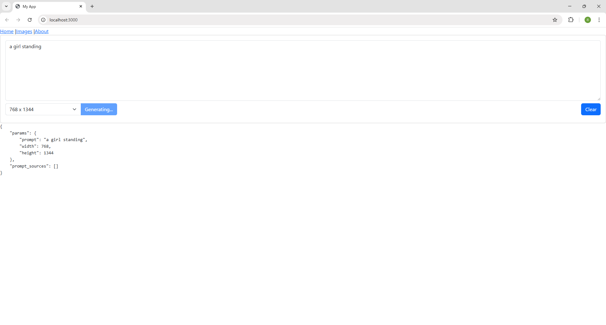
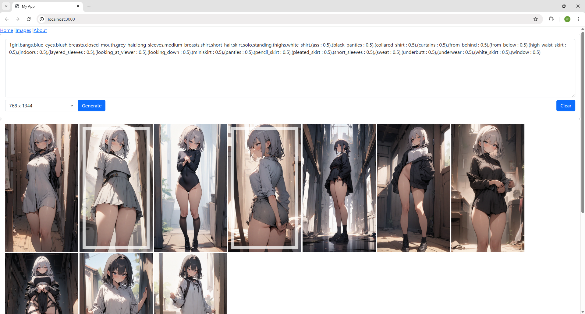

# Loop Image Generator

ユーザが気に入った画像を選択することで、StableDiffusionの出力を嗜好に沿って“収束”させていく自動画像生成ツールです。

## 概要

- 初期プロンプトから画像を10枚生成
- 気に入った画像を選択 → itot技術によりプロンプト抽出
- 抽出された複数プロンプトを合成し、再度画像生成
- 上記を繰り返すことで、好みに沿った画像に収束可能

## 技術構成

- **BackEnd:** FastAPI（ComfyUI連携、画像生成処理）
- **FrontEnd:** React（画像選択UI）
- **Image Generator:** Stable Diffusion (via ComfyUI)
- **Prompt Extractor:** WD14Tagger (via ComfyUI)

## 動作イメージ

1. 最初に簡単なプロンプトで画像生成

2. 出力された画像を選択すると　画像から自動でプロンプトが生成される

3. 2で出力されたプロンプトをもとに画像生成

4. 2,3 を繰り返すことで精度を上げていく

## 使用方法

1. ComfyUIを起動しておく
2. バックエンド起動

cd backend && uvicorn main:app --reload

3. フロントエンド起動

cd frontend && yarn dev

4. ブラウザで http://localhost:3000 にアクセス

## 動作確認環境

- Python 3.8.10
- ComfyUI v0.3.37
- Node.js v22.15.1

## 備考

- 個人開発・非商用目的
- 一部構成は ComfyUI 等のOSSに依存

